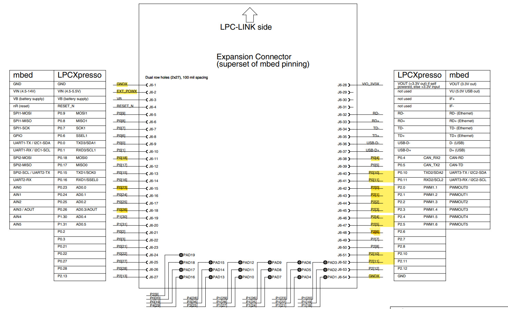

# TP-FINAL-ED3

## Autores
- Bernaus, Julieta
- Pasolli, Néstor Jeremías

## Descripción
El siguiente es un proyecto integrador para la materia Electrónica Digital III de la Universidad Nacional de Córdoba, año 2023.
Se hace uso de una placa LPC1769 de núcleo ARM Cortex M3.

En este trabajo, se presenta un prototipo funcional de una alarma casera.

### Detalles de la implementación
La misma cuenta con:
- Sensores de movimiento,
- Sensor de gases, 
- Un teclado para su activación y desactivación, 
- Comunicación Bluetooth con celular, tanto para mostrar datos del estado de la alarma como para activarla y desactivarla (comunicación en ambos sentidos).

## Pin-out

- P0.10 : UART - Receptor
- P0.11 : UART - Transmisor
- P0.18 : LED para mostrar estado de la alarma
- P0.4  : LED indicador de pulsación de tecla
- P0.23 : AD0, entrada del canal 0 del ADC para el sensor de gases
- P0.26 : AOUT, salida analógica del DAC, para enviar a un parlante externo el sonido de la alarma
- P2.0  : salida del teclado matricial
- P2.1  : salida del teclado matricial
- P2.2  : salida del teclado matricial
- P2.3  : salida del teclado matricial
- P2.4  : entrada del teclado matricial
- P2.5  : entrada del teclado matricial
- P2.6  : entrada del teclado matricial
- P2.10 : EINT0 para un sensor de movimiento
- P2.11 : EINT1 para otro sensor de movimiento
- Conexión a tierra de ambos lados de la placa
- Conexión externa a fuente de 5V

## Implementaciones

### ADC

Se utiliza el módulo ADC para obtener datos de un sensor de gases MQ-135. Este sensor entrega a su salida de 0V a 5V dependiendo de la medición. El ADC convierte y analiza este valor para determinar si supera un valor umbral definido. De detectar un valor que supere el umbral con la alarma activada la disparará.

### DAC

Se utiliza el módulo DAC para entregar una señal de audio a un parlante externo, que emite un sonido de alarma cuando esta se dispara. Los datos parqa generar la señal de audio se encuentran en la memoria y son transferidos al DAC mediante DMA cuando la alarma se dispara, emitiendo el sonido por el parlante.

### DMA

Este módulo se ocupa de la señal a emitir por el DAC, entregando los valores para conformar la señal de audio de alarma, liberando al núcleo de esta tarea.

### EINT

Se utilizan dos pulsadores para simular sensores de movimiento, mediante interrupciones externas que se disparan al pulsarlos, por flanco descendente.

### GPIO

Se utilizan pines como GPIO para controlar un teclado matricial de 4x3 mediante polling. Este teclado activa y desactiva la alarma. Además, existe un LED indicador que se prende cuando la alarma está encendida. Mediante la pulsación de un código especial de dos dígitos permite disparar instantáneamente la alarma.

### Timers

Se utilizan los timers 0,1 y 2. Con el timer 0 se maneja la frecuencia de conversión del ADC, generando una conversión cada aproximadamente 8 segundos para obtener datos del sensor de gas. Con el timer 1 se maneja el breve encendido de un led amarillo, que indica la pulsación de una tecla. El timer 2 se encarga de resetear la posición del array que guarda la contraseña del usuario, para que luego de un pequeño tiempo sin pulsaciones de teclas se deba ingresar la contraseña completa nuevamente.

### UART

Se ha usado la transmisión UART en conjunto con un módulo HC-05 para la transmisión bidireccional mediante Bluetooth. A través de él, se puede encender y apagar la alarma, colocando el código, y recibir información sobre su estado cuando este cambie. También se puede disparar directamente la alarma desde el celular, enviando el código especial de dos dígitos.
