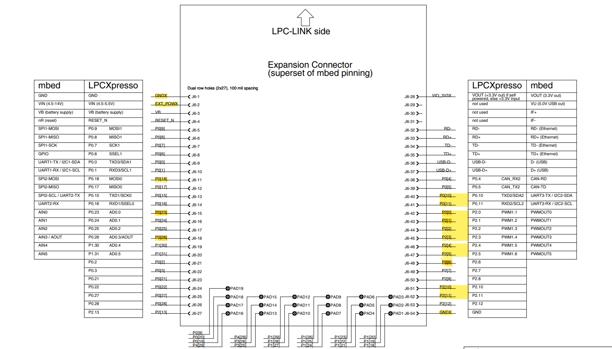

# TP-FINAL-ED3

## Autores
- Bernaus, Julieta
- Pasolli, Néstor Jeremías

## Descripción
El siguiente es un proyecto integrador para la materia Electrónica Digital III de la Universidad Nacional de Córdoba, año 2023.
Se hace uso de una placa LPC1769 de núcleo ARM Cortex M3.

En este trabajo, se presenta un prototipo funcional de una alarma casera.

### Detalles de la implementación
La misma cuenta con:
- sensores de movimiento,
- sensor de gases, 
- un teclado para su activación y desactivación, 
- comunicación Bluetooth con computadora, tanto para mostrar datos medidos como para activar y desactivarla.

## Pin-out

- P0.10 : UART - Receptor
- P0.11 : UART - Transmisor
- P0.18 : LED para mostrar estado de la alarma
- P0.23 : ADC para el sensor de gases
- P0.26 : DAC para el buzzer que provoca el sonido de alarma
- P2.0  : salida del teclado matricial
- P2.1  : salida del teclado matricial
- P2.2  : salida del teclado matricial
- P2.3  : salida del teclado matricial
- P2.4  : entrada del teclado matricial
- P2.5  : entrada del teclado matricial
- P2.6  : entrada del teclado matricial
- P2.10 : EINT0 para un sensor de movimiento
- P2.11 : EINT1 para otro sensor de movimiento
- Conexión a tierra de ambos lados de la placa
- Conexión externa a batería de 5V

## Implementaciones

### ADC

Se utiliza el módulo ADC para un sensor de gases MQ-135, que sensa, cuando la alarma está encendida, la concentración de gases en el ambiente. De detectar algo peligroso, hace sonar la alarma.

### DAC

Se utiliza el módulo DAC con un buzzer, que emite un sonido de alarma cuando esta se dispara. Este módulo está conectado con el ADC (que lo dispara) y con el DMA.

### DMA

Este módulo se ocupa de la señal a emitir por el DAC mientras el core puede estar atento al teclado que lo desactiva.

### EINT

Se utilizan dos pulsadores para simular sensores de movimiento, mediante interrupciones externas que se disparan al pulsarlos.

### GPIO

Se utiliza el GPIO para controlar un teclado matricial de 3x4 mediante polling. Este teclado activa y desactiva la alarma. Además, existe un LED indicador que se prende cuando la alarma está encendida.

### Timers

Se utilizan los timers 0 y 1. Con el timer 0, se manejan las interrupciones externas, mientras que con el timer 1, se controla al UART.

### UART

Se ha usado un módulo HC-05 para la transmisión bidireccional mediante Bluetooth. A través de él, se puede encender y apagar la alarma, y recibir información sobre su estado.

